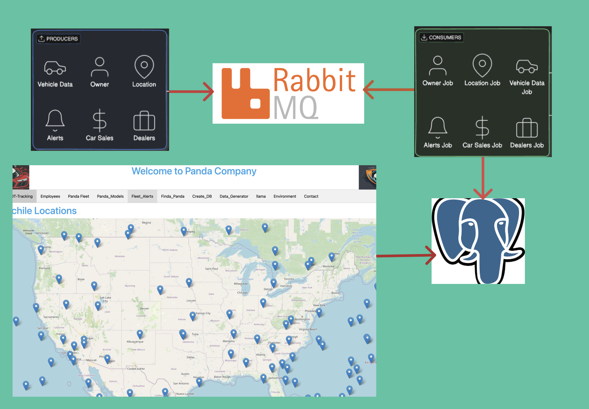

# panda-python-web-app

<p align="center">

</p>


# Requirements:
1. postgres db to run the postgres project
2. oracle db to run the oracle project
3. Rabbitmq to run the data generator and loaders project.


# Running the Oracle Project:
1. linux vm to run oracle docker image
2. Deploy an oracle db using docker
Option 1:
```
docker run -d -p 1521:1521 -e ORACLE_PASSWORD=XXXXX -v oracle-volume:/opt/oracle/oradata gvenzl/oracle-xe
```
Option 2:
```
https://github.com/oracle/python-oracledb/tree/main/samples/sample_container
```
4. rename the db_config_sample.py to db_config.py and update your connection parameters to oracledb and rabbitmq 
5. Run the python oracle Project on local
```
python3 panda-company-ora.py
```

# Panda-Company-feature
1. Provides data generator that genrates random data for various jobs
2. Provides data loaders that can load the data to postgres db


<p align="center">

</p>
