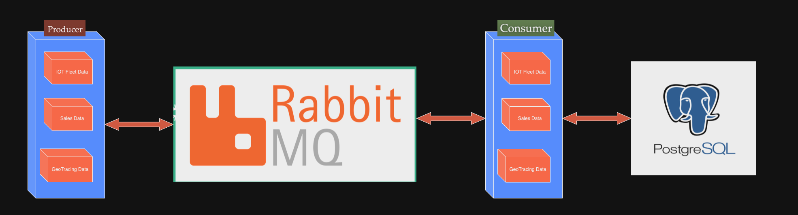

# panda-python-web-app
<p align="center">

</p>

# Requirements:
1. postgres db to run the postgres project
2. oracle db to run the oracle project
3. Rabbitmq to run the data generator and loaders project.

# Running the Oracle Project:
1. linux vm to run oracle docker image
2. Deploy an oracle db using docker

Option 1:
```
docker run -d -p 1521:1521 -e ORACLE_PASSWORD=XXXXX -v oracle-volume:/opt/oracle/oradata gvenzl/oracle-xe
```
Option 2:
```
https://github.com/oracle/python-oracledb/tree/main/samples/sample_container
```
4. rename the db_config_sample.py to db_config.py and update your connection parameters to Oracledb and RabbitMQ
5. Run the python oracle Project on local
```
python3 panda-company-ora.py
```

# Running the Postgres Project:
1. Postgres running locally or k8s
2. Rename the files db_config_sample.py to db_config.py and update your configuration for Postgress and RabbitMQ
3. Run the python postgres project on local
```
python3 panda-company-postgres.py
```

# Panda-Company-feature AI and IOT
1. Provides data generator that genrates random data for various jobs
2. Provides data loaders that can load the data to postgres db
3. Update the config values for Postgres, RabbitMQ and OLLAMA
4. Run the python postgres freature project on local
```
python3 panda-company-postgres-feature.py
```

## Data generators
> Data generator comes with various jobs that can produce random data and send a json payload to RabbitMQ queue_declare

## Data loaders
> Data loaders are equipped to read the json payload from RabbitMQ queue and save the data to PostgresDB or OracleDB

<p align="center">

</p>


## Running the project on Tanzu Plaform For Cloud Foundry(TPCF)
> Currently the python buildpack does not support some of libraries used in the project. However we can build a docker image and run this application to demo a COTS application on TPCF

1. Build a docker image using the Dockerfile-feature-TPCF
2. cf push panda-company-tpcf <docker image>
> CF_DOCKER_PASSWORD="$(cat key.json)" cf push panda-company-feature --docker-image <DOCKERIMAGE> --docker-username _json_key -k 2G

3. cf bind-service postgresdb panda-company-tpcf
4. cf bind-service rabbitmq panda-company-tpcf
